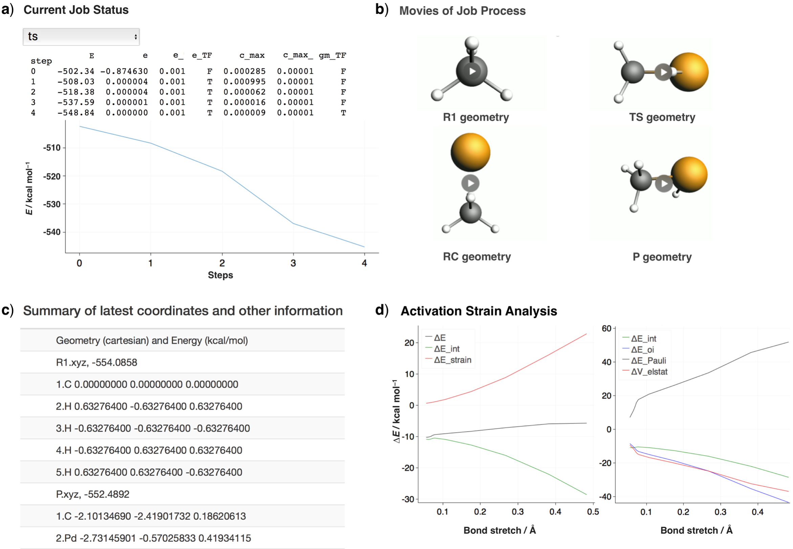

PyFrag
#######
See documentation_ for tutorials and documentation.

Motivation
==========
The PyFrag program is specially designed to facilitates the study of reaction mechanism in a more efficient and user-friendly way. It is an expansion of a popular program also named by pyfrag_ in group_ of Bickelhaupt. It automates the process of finding transition states, potential energy surface by using one simple input file. It follows by an activation strain analysis on the energy profile to characterize the feature of the reaction mechanism and gain insights into the overall reaction energies. Moreover, users can have an real-time monitoring of the running process via a webpage which vividly displays the updated data in the form of videos and figures and, if necessary, user can rerun the job immediately from where it stops. In this way, the three respects of computational chemistry–job management, data management and analysis management can all be contained in a framework and thus allow chemists to focus on the interpretation and creation work rather than waste time and energy on the finding and processing of massive data.

Description
===========

Usage
------------

User can type pyfrag -h to see all the commands that can be used in this program, which will show something like: ::
Usage: /Users/xiaobo/gitpyfrag/bin/pyfrag [-h] [-s] [-x command]  [...]

          -h          : print this information
          -s          : run job quietly
          -x          : start the executable named command
                      : command include restart, which restart job
                      : end, which terminate job
                      : check, which check the latest jobs information
                      : restart, which restart a job after it is stoped
                      : summary, which summarize all job result after jobs finished
                      : default command is pyfrag itself
          The example command is like as follow, in which job.in is job input
          /Users/xiaobo/gitpyfrag/bin/pyfrag job.in
          or
          /Users/xiaobo/gitpyfrag/bin/pyfrag -x restart job.in
          or
          /Users/xiaobo/gitpyfrag/bin/pyfrag -s -x summary job.in

Input example
-------------

For Example, the default parameter for a geometry optimization using ADF are given by: ::

   #!/bin/bash
   #SBATCH -J frag_1
   #SBATCH -N 1
   #SBATCH -t 50:00
   #SBATCH --ntasks-per-node=24
   #SBATCH --partition=short
   #SBATCH --output=%job.stdout
   #SBATCH --error=%job.stdout
   export NSCM=24

   JOBSUB END

   ADF

   basis
   type TZ2P
   core Small
   end

   xc
   gga OPBE
   end

   relativistic SCALAR ZORA

   scf
   iterations 299
   converge 0.00001
   mixing 0.20
   end

   numericalquality verygood

   charge 0 0
   symmetry auto

   ADF END

   PyFrag

   fragment  2
   fragment  1 3 4 5 6
   strain    0
   strain   -554.09
   bondlength 1 6  1.09

   PyFrag END

   Geometrycoor

   R1: Fe-II(CO)4 + CH4
   Pd       0.00000000       0.00000000       0.32205546

   R2: CH4
   C       0.00000000       0.00000000      -1.93543634
   H      -0.96181082       0.00000000      -1.33610429
   H       0.00000000      -0.90063254      -2.55201285
   H       0.00000000       0.90063254      -2.55201285
   H       0.96181082       0.00000000      -1.33610429

   RC: Fe-II(CO)4 + CH4
   C       0.00000000       0.00000000      -1.93543615
   Pd       0.00000000       0.00000000       0.322055
   H      -0.96181082       0.00000000      -1.33610429
   H       0.00000000      -0.90063254      -2.55201285
   H       0.00000000       0.90063254      -2.55201285
   H       0.96181082       0.00000000      -1.33610429

   TS: Fe-II(CO)4 + CH4
   C      -1.74196777      -2.22087997       0.00000000
   Pd     -2.13750904      -0.23784341       0.00000000
   H      -2.80956968      -2.49954731       0.00000000
   H      -1.26528821      -2.62993236       0.8956767
   H      -1.26528821      -2.62993236      -0.895676
   H      -0.75509932      -0.88569836       0.00000000

   P: Fe-II(CO)4 + CH4
   C      -2.10134690      -2.41901732       0.1862099
   Pd      -2.73145901      -0.57025833       0.419766
   H      -3.88639130      -1.04648079      -0.43099501
   H      -2.78392696      -3.12497645       0.66994616
   H      -1.97386865      -2.66955518      -0.87144525
   H      -1.12556673      -2.41201402       0.698583

   Geometrycoor END

Result example
--------------

Tutorial and more Examples
---------------------
A tutorial written as a jupyter-notebook is available from notebook_. You can
also access direclty more examples.

Installation
------------
For installation, please read installation_.

.. _documentation: https://pyfragdocument.readthedocs.io/en/latest/
.. _pyfrag: https://sunxb05.github.io/pyfrag/
.. _group: http://www.few.vu.nl/~bickel/
.. _examples: https://github.com/sunxb05/PyFrag/tree/master/example
.. _notebook: https://github.com/sunxb05/PyFrag/tree/master/jupyterNotebooks/
.. _installation: https://pyfragdocument.readthedocs.io/en/latest/install.html
